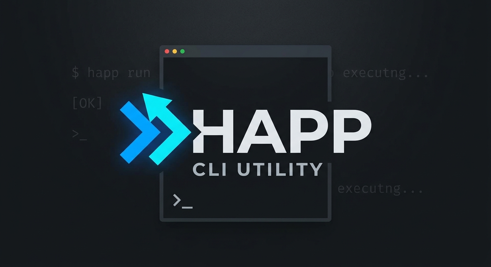

<p align="center">
  
</p>

# happ-cli

**English** | [Русский](README.ru.md)

A terminal VPN client compatible with [HAPP](https://happ.su) subscription
profiles. It fetches a subscription, parses its share links
(VLESS / VMess / Trojan / Shadowsocks), and connects through an embedded
[xray-core](https://github.com/XTLS/Xray-core) — as a local proxy, a system
proxy, or a full system-wide TUN tunnel.

Single self-contained binary: xray-core and tun2socks are embedded, no external
binaries required.

## Features

- **HAPP-compatible** subscriptions: a subscription URL returns a base64 list of
  share links, and the metadata headers HAPP clients understand are read:
  `subscription-userinfo` (traffic/expiry), `profile-title`,
  `profile-update-interval`, `support-url`. Requests are sent with
  `User-Agent: Happ/1.0` so panels return the format HAPP expects (overridable
  with `--ua`).
- **Protocols**: VLESS (incl. Reality / XTLS Vision), VMess, Trojan,
  Shadowsocks. **Transports**: TCP, WebSocket, gRPC, HTTP/2. **Security**: TLS,
  Reality.
- **Three ways to route traffic**:
  - `connect` — local SOCKS5 + HTTP proxy on `127.0.0.1` (no root);
  - `connect --system-proxy` — sets the macOS system SOCKS + HTTP/HTTPS proxy
    (needs `sudo`), so browsers and most apps go through it without touching the
    routing table — coexists with another active VPN;
  - `connect --mode tun` — full system-wide VPN via a utun device (needs `sudo`).

> **Note**: xray-core cannot dial Hysteria2 / TUIC / WireGuard outbounds. Such
> servers are still parsed and listed (marked `unsupported`), but you cannot
> connect to them through xray (a sing-box based core would be required).

## How it works

```
subscription URL
      │  profile.Fetch (User-Agent: Happ/1.0)
      ▼
base64 list of links ──► link.Parse ──► []link.Server
                                            │ xray.BuildConfig
                                            ▼
                                    xray-core config (JSON)
                                            │ xray.Start (embedded core)
              ┌─────────────────────────────┼─────────────────────────────┐
              ▼                             ▼                             ▼
      proxy: SOCKS5/HTTP          --system-proxy: networksetup     tun: tun2socks
      on 127.0.0.1                sets system SOCKS/HTTP            + route table
      (no root)                   (sudo)                           (sudo, utun)
```

## Install

### mise (recommended)

Prebuilt binaries are published to GitHub Releases. Install with
[mise](https://mise.jdx.dev) — no Go toolchain required. The binary inside the
archive is `happ` (not `happ-cli`), so pass `exe=happ`:

```sh
mise use -g "github:aimuzov/happ-cli[exe=happ]@latest"
```

or pin it in `mise.toml`:

```toml
[tools]
"github:aimuzov/happ-cli" = { version = "latest", exe = "happ" }
```

The `ubi` backend works the same way against the same releases, if you prefer it:
`ubi:aimuzov/happ-cli[exe=happ]`.

> For frequent installs, set `MISE_GITHUB_TOKEN` (or `GITHUB_TOKEN`) to avoid
> GitHub API rate limits.

### Manual download

Download the archive for your OS/arch from the
[Releases](https://github.com/aimuzov/happ-cli/releases) page, extract it, and
put the `happ` binary on your `PATH`.

### From source

```sh
git clone https://github.com/aimuzov/happ-cli
cd happ-cli
go build -o happ .   # requires Go 1.26+
```

The resulting `happ` binary is self-contained.

> **`go install github.com/aimuzov/happ-cli@latest` does not work.** The build
> relies on a `replace` directive in `go.mod` (to reconcile xray-core and
> tun2socks on gvisor), and `go install pkg@version` ignores `replace`. Use a
> prebuilt binary or clone and build.

## Usage

### Subscriptions

```sh
happ sub add https://panel.example/sub/TOKEN --name myvpn   # add (becomes active)
happ sub list                                               # list subscriptions
happ sub update [name]                                      # re-fetch (default: active)
happ sub use <name>                                         # set the active subscription
happ sub rm <name>                                          # remove
```

`sub list` shows traffic and expiry from the subscription headers:

```
ACTIVE  NAME    TITLE       SERVERS  TRAFFIC          EXPIRES
*       myvpn   My VPN      12       12.4 GB / 200 GB  2026-09-01
```

### Servers

```sh
happ list           # servers in the active subscription
happ list --sub x   # servers in a specific subscription
```

```
#  PROTOCOL                 ADDRESS              TAG
1  vless                    de.example:443       🇩🇪 Germany
2  trojan                   nl.example:443       🇳🇱 Netherlands
3  hysteria2 (unsupported)  hy.example:443       Fast HY2
```

### Connecting

`connect` runs in the foreground until interrupted with `Ctrl+C`. The `selector`
picks a server: empty = first, a number = 1-based index from `happ list`, or a
case-insensitive substring of the server tag.

```sh
happ connect                 # first server, proxy mode
happ connect 2               # server #2
happ connect germany         # first server whose tag matches "germany"

sudo happ connect 1 --system-proxy   # browsers/apps via system proxy (no routing changes)
sudo happ connect 1 --mode tun       # full system-wide VPN
```

In plain proxy mode, point apps at `socks5://127.0.0.1:10808` (Firefox: enable
"Proxy DNS when using SOCKS v5").

### `connect` flags

| Flag             | Default | Description                                         |
| ---------------- | ------- | --------------------------------------------------- |
| `-m, --mode`     | `proxy` | `proxy` or `tun`                                    |
| `--socks`        | `10808` | local SOCKS5 port                                   |
| `--http`         | `10809` | local HTTP proxy port (proxy mode)                  |
| `--system-proxy` | `false` | set the macOS system proxy (proxy mode, needs sudo) |
| `--sub`          | active  | subscription name                                   |

### Three ways to route traffic, compared

- **`connect` (proxy)** — only apps explicitly pointed at
  `socks5://127.0.0.1:10808` (e.g. Firefox with remote DNS). No root.
- **`connect --system-proxy`** — sets, on every enabled network service, the
  system SOCKS (`--socks` port) and HTTP/HTTPS (`--http` port) proxies, so
  Safari/Chrome and apps that ignore SOCKS go through the proxy. Does **not**
  touch the routing table, so it **coexists with another active VPN**. Needs
  `sudo`; the previous proxy settings are restored on exit. If a session was
  killed (`kill -9`) and the proxy stuck, reset it with
  `sudo happ system-proxy off`.
- **`connect --mode tun`** — a full system VPN via a utun device; captures all
  traffic. Needs `sudo`. If another VPN is active at the same time, disconnect it
  first so the tunnels don't fight over routes/DNS.

### Other commands

```sh
happ config [selector]       # print the generated xray-core config (debug)
happ system-proxy off        # emergency reset of the system proxy (sudo)
```

## Configuration & storage

State (subscriptions and cached links) is stored as `state.json` in the
per-user config directory (`~/Library/Application Support/happ-cli` on macOS),
overridable with the global `--home` flag.

## TUN mode details (macOS)

1. the server address is resolved to IP(s), and a host route to each is pinned to
   its current next hop (a physical gateway, or an already-active VPN interface),
   so the proxy's own connection to the server does not loop back into the tunnel;
2. a `utun` device is created and tun2socks forwards its traffic to the local
   SOCKS proxy served by xray;
3. the default route is overridden with two `/1` routes scoped to the utun device
   (the real default route is left intact for a clean teardown);
4. global IPv6 is routed into `lo0` (blocked), so IPv6-capable sites
   (Google, YouTube) don't leak outside the tunnel — apps fall back to IPv4
   through the tunnel; link-local IPv6 keeps working via its more-specific route;
5. on `Ctrl+C` all routes are removed in reverse order.

## Limitations

- **Hysteria2 / TUIC / WireGuard** cannot be dialed by xray-core (they are parsed
  and listed as `unsupported`). Most HAPP profiles are VLESS-Reality and work
  fully.
- **TUN and `--system-proxy` are macOS-only** in this version.
- **IPv6 is blocked in TUN mode** (the proxy path is IPv4); IPv6-only
  destinations become unreachable while connected.
- `connect` runs in the **foreground**; there is no background daemon yet.
- A `kill -9` skips cleanup: a system proxy stays set (`sudo happ system-proxy
off`) and TUN IPv6-block routes remain (`sudo route -n delete -inet6 -net
::/1; sudo route -n delete -inet6 -net 8000::/1`). A normal `Ctrl+C` cleans up.

## Project layout

| Package             | Responsibility                                              |
| ------------------- | ----------------------------------------------------------- |
| `internal/link`     | parse share links (vless/vmess/trojan/ss/hysteria2)         |
| `internal/profile`  | fetch a subscription, decode the base64 list + headers      |
| `internal/xray`     | build xray-core config from a server, run the embedded core |
| `internal/tunnel`   | TUN mode: tun2socks + macOS route management                |
| `internal/sysproxy` | macOS system proxy via networksetup                         |
| `internal/store`    | persist subscriptions and cached links                      |
| `internal/cli`      | cobra commands                                              |

## Development

```sh
go test ./...        # unit tests + a real end-to-end proxy test
go vet ./...
```

The xray integration test starts a real Shadowsocks server and a client built
from a `link.Server`, then verifies an HTTP request routed through the client's
SOCKS inbound reaches a target through the proxy.

> xray-core and tun2socks require different `gvisor.dev/gvisor` versions; a
> `replace` directive in `go.mod` pins gvisor to the version both build against.
> Don't drop it — see the comment there.

### Releasing

Releases are built by [GoReleaser](https://goreleaser.com) in CI on a tag push:

```sh
git tag v0.1.0
git push origin v0.1.0
```

The `release` workflow (`.github/workflows/release.yml`) builds darwin/linux
binaries for amd64/arm64 and uploads them to GitHub Releases. Building there
honors the `go.mod` `replace` directive (happ-cli is the main module). Dry-run
locally with `goreleaser release --clean --snapshot`.
